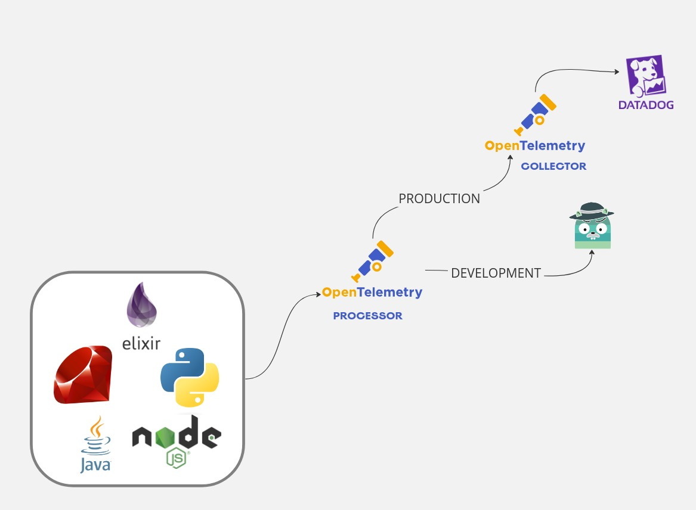

# About

This repository contains OpenTelemetry recipes, such as the Otel processor to prevent revealing sensitive data.

> The following diagram shows how traces are collected and processed before being sent to Jagger locally or via an external source such as DataDog.


# Traces example

The following example generates sensitive data: Email, Password, Credit Card, and VATNumber:

- customer.email
- customer.password
- customer.credit_card
- customer.vatnumber



# Run

## How do I launch containers?

```shell
docker compose --profile all up -d 
```

## Inspecting OTEL logs

```shell
docker compose logs -f otel
```

## Producing metrics

```shell
curl http://localhost:8000
```

## Jaeger UI

http://localhost:16687


# References

[OpenTelemetry Configuration - Processors](https://opentelemetry.io/docs/collector/configuration/#processors)