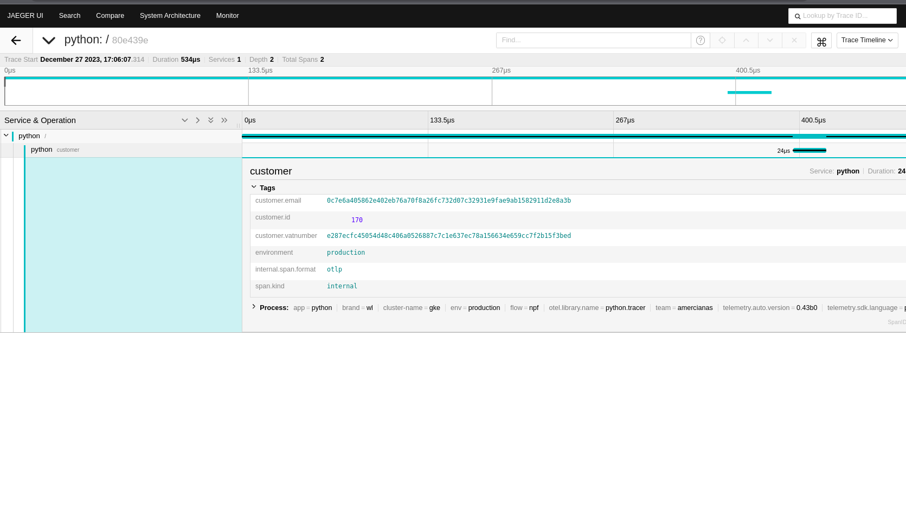

# About

This repository has a proof-of-concept that uses the Opentelemetry processor to prevent revealing sensitive data.

> The following step is to generate samples in the programming languages used by Americanas, such as Java, Node.js, Elixir, and Ruby.

# The example

The following example generates sensitive data: Email, Password, Credit Card, and VATNumber:

- customer.email
- customer.password
- customer.credit_card
- customer.vatnumber

# Run

## How do I launch containers?

```shell
docker compose up -d
```

## Inspecting OTEL logs

```shell
docker compose logs -f otel
```

## Producing metrics

```shell
curl http://localhost:8000
```

## Jaeger UI

http://localhost:16687

